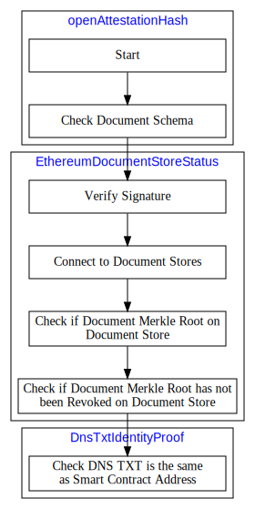
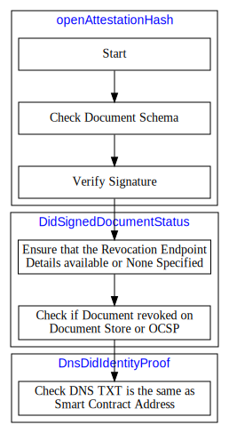

import Tabs from '@theme/Tabs';
import TabItem from '@theme/TabItem';

import VerifiableDocsETHLight from './diagram/verifiable-docs-eth.light.svg';
import VerifiableDocsDIDLight from './diagram/verifiable-docs-did.light.svg';

In brief, the verification flow runs three checks on the document: 

1. The document integrity check
1. The issuance status check
1. The issuance identity check

Only when it passes all three checks, will it count as a valid OA document.

## Ethereum
The diagram below shows the verification flow on OA documents issued using the Ethereum method: 

## DID
The diagram below shows the verification flow on OA documents issued using the DID method:

## Verification methods
See the list of verification methods [here](../remote-files/open-attestation-verify#verification-method).
